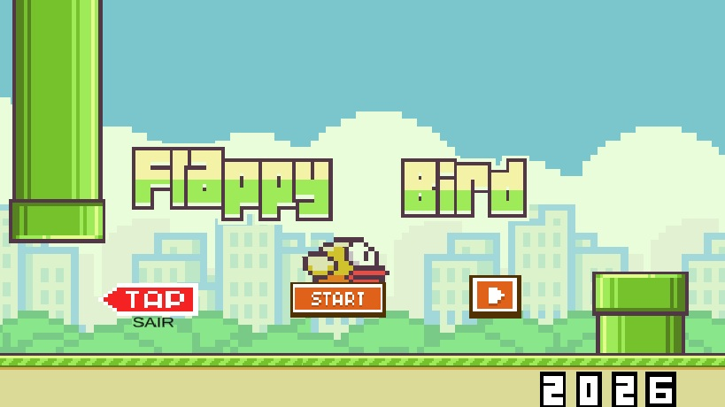

# Flappy Bird Clone

Um jogo inspirado no clássico **Flappy Bird**, desenvolvido em **Unity** utilizando **C#** como parte de um desafio proposto pelo Professor **Pedro Holobuski** durante o curso Técnico em Desenvolvimento de Games do **SENAC**.

O objetivo do projeto foi aplicar conceitos fundamentais do desenvolvimento de jogos 2D, colocando em prática lógica de programação, programação orientada a objetos e boas práticas utilizando a Unity Engine.

---

## 📖 Sobre o projeto

Neste jogo, o jogador deve controlar o pássaro e desviar dos obstáculos para alcançar a maior pontuação possível.

Apesar da mecânica simples, o projeto permitiu explorar diversas funcionalidades importantes do desenvolvimento de jogos, desde a criação da interface até o gerenciamento de cenas e persistência de dados.

Todo o desenvolvimento do projeto foi realizado por mim, incluindo programação, implementação das mecânicas, interface, testes e refinamentos.

---

## 🚀 Funcionalidades

* Controle do personagem utilizando Física 2D
* Geração contínua de obstáculos
* Sistema de pontuação
* Sistema de recorde (High Score)
* Persistência de dados com PlayerPrefs
* Interface utilizando TextMesh Pro
* Gerenciamento de cenas
* Sistema de colisão
* Controle de áudio
* Telas de início, derrota e vitória

---

## 🛠 Tecnologias utilizadas

* Unity
* C#
* TextMesh Pro
* PlayerPrefs
* Git
* GitHub

---

## 📷 Capturas de tela

Adicione aqui imagens ou GIFs do jogo.

Exemplo:

```
/Images/menu.png
/Images/gameplay.png
/gameplay.gif
```

---

## 🎮 Como jogar

1. Clone este repositório:

```bash
git clone https://github.com/DefaultCode01/FlappyBird.git
```

2. Abra o projeto na Unity.

3. Execute a cena inicial.

4. Controle o pássaro utilizando:

* **Espaço**
* **Clique esquerdo do mouse**

O objetivo é passar pelos obstáculos sem colidir e obter a maior pontuação possível.

---

## 📚 Aprendizados

Durante o desenvolvimento deste projeto foram praticados conceitos como:

* Programação Orientada a Objetos (POO)
* Organização de scripts
* Gerenciamento de cenas
* Manipulação de UI
* Física 2D
* Controle de áudio
* Persistência de dados
* Estruturação de projetos na Unity
* Versionamento utilizando Git e GitHub

---

## 🙏 Agradecimentos

Agradeço ao Professor **Pedro Holobuski** pela proposta do desafio e pelos conhecimentos compartilhados durante o curso Técnico em Desenvolvimento de Games do **SENAC**.

Este projeto representa uma importante etapa do meu aprendizado e evolução como desenvolvedor.

---

## 👨‍💻 Desenvolvedor

**Matheus da Silva Gomes**

* GitHub: https://github.com/DefaultCode01
* LinkedIn: https://www.linkedin.com/in/matheus-da-silva-gomes-baa89a23b
* Link do jogo: https://mattgamesdev.itch.io/flappbirdschool-project

---

⭐ Se este projeto foi interessante para você, deixe uma estrela no repositório!

